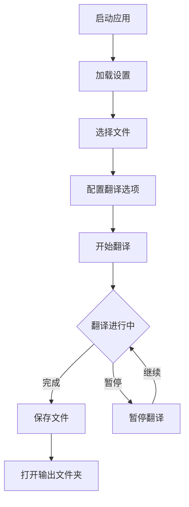
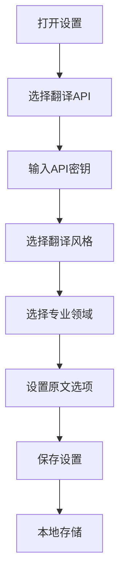

# ePub双语翻译工具 UI指南

## 界面结构

### 1. 主界面
```
┌─────────────────────────────────────────┐
│ ePub双语翻译工具                  ⚙️设置  │
│ 将英文ePub电子书翻译成中英对照版本      │
├─────────────────────────────────────────┤
│ 选择文件                               │
│ [选择的文件名.epub]           [浏览按钮] │
├─────────────────────────────────────────┤
│ 总进度                                 │
│ [==========] 50%                       │
│                                       │
│ 当前章节: 5/10                         │
│ 章节进度: 75%                          │
│ 预计剩余时间: 10分30秒                  │
│                                       │
│ [状态图标] 正在翻译...     [暂停] [开始] │
└─────────────────────────────────────────┘
```

### 2. 设置对话框
```
┌─────────────────────────────────────┐
│ 翻译设置                            │
├─────────────────────────────────────┤
│ 翻译API                            │
│ ┌─────────────────────────────────┐ │
│ │ ✓ DeepSeek API                  │ │
│ │   专业的AI翻译引擎               │ │
│ │   [API密钥输入框]               │ │
│ ├─────────────────────────────────┤ │
│ │   OpenAI API                    │ │
│ │   GPT模型翻译                   │ │
│ ├─────────────────────────────────┤ │
│ │   Google Translate              │ │
│ │   谷歌翻译服务                  │ │
│ └─────────────────────────────────┘ │
│                                     │
│ 翻译风格                            │
│ ┌─────────────────────────────────┐ │
│ │   直译                          │ │
│ │   忠实原文，适合技术文档         │ │
│ ├─────────────────────────────────┤ │
│ │ ✓ 平衡                          │ │
│ │   准确性和流畅性的平衡           │ │
│ ├─────────────────────────────────┤ │
│ │   意译                          │ │
│ │   通顺优美，适合文学作品         │ │
│ └─────────────────────────────────┘ │
│                                     │
│ 专业领域                            │
│ ┌─────────┐ ┌─────────┐ ┌─────────┐ │
│ │ ✓ 通用  │ │ 技术    │ │ 文学    │ │
│ └─────────┘ └─────────┘ └─────────┘ │
│ ┌─────────┐ ┌─────────┐            │
│ │ 商业    │ │ 学术    │            │
│ └─────────┘ └─────────┘            │
│                                     │
│ [✓] 保留英文原文                    │
│                                     │
│             [保存设置]              │
└─────────────────────────────────────┘
```

## 功能流程

### 1. 主要流程


### 2. 设置流程


## 状态说明

### 1. 翻译状态
- `idle`: 准备就绪
- `translating`: 正在翻译
- `paused`: 已暂停
- `success`: 翻译完成
- `error`: 出错

### 2. 进度显示
- 总进度：整本书的翻译进度
- 章节进度：当前章节的翻译进度
- 预计剩余时间：基于当前翻译速度估算

### 3. 图标说明
- ⚙️ 设置
- 📁 浏览
- ⏸️ 暂停
- ▶️ 继续
- ✓ 完成
- ⚠️ 错误

## 响应式设计

### 1. 桌面布局 (>768px)
- 水平布局
- 完整功能显示
- 并排显示按钮和状态

### 2. 移动布局 (<768px)
- 垂直布局
- 折叠部分功能
- 堆叠显示按钮和状态

## 交互逻辑

### 1. 文件选择
1. 点击浏览按钮
2. 打开系统文件选择器
3. 仅显示.epub文件
4. 选择文件后显示文件名

### 2. 翻译控制
1. 开始翻译
   - 检查API配置
   - 验证文件选择
   - 开始翻译进程
2. 暂停/继续
   - 暂停当前翻译
   - 保存进度
   - 可随时继续
3. 完成操作
   - 显示成功状态
   - 提供打开文件夹选项

### 3. 设置管理
1. API设置
   - 选择API提供商
   - 输入并验证API密钥
   - 密钥本地加密存储
2. 翻译选项
   - 选择翻译风格
   - 选择专业领域
   - 设置原文选项
3. 设置保存
   - 自动保存到localStorage
   - 程序启动时自动加载 